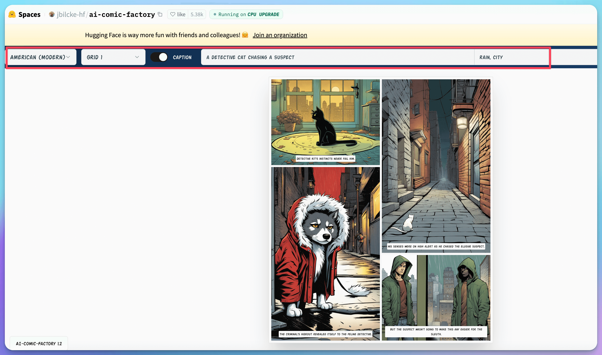

# 🖌️ Comics & Manga

## How to create Manga using AI？

### 1. Do it manually

The first step, use an LLM such as ChatGPT/Claude to create the necessary components for your comics, including the story, scripts, storyboards, etc.

Then, select a text-to-image tool that suits your needs

We will use Midjourney here, known for its high-quality and consistent outputs. Notably, it includes NIJI Journey, a feature specifically tailored for anime and comic creation, making it an excellent choice for comic generation. Furthermore, its recent updates have significantly improved character consistency, effectively addressing the previously challenging problem of maintaining continuity in characters generated by the tool.

In the last step, simply position each image within a drawing or comic editing app as desired.&#x20;

***

### 2. AI Comic Apps

A more straightforward approach would be to utilize AI applications specifically tailored for comic creation.

### SkyReels AI (ComicAI)

[https://skyreels.ai/](https://skyreels.ai/)

SkyReels offers a platform to create unique visual narratives in four steps, emphasizing consistency and efficiency. It features advanced algorithms to maintain uniformity in characters, styles, and backgrounds across projects.&#x20;

***

### AI Comic Factory



AI Comic Factory app, which is currently up for trial on Huggingface. It uniquely fuses LLM and SDXL technologies, offering an intuitive interface that only requires a set of prompts to craft both narrative and imagery.&#x20;

<figure><figcaption></figcaption></figure>

***

### Animate Comic

A manga artist from Japan utilized <mark style="color:red;">AnimateDiff</mark> to bring to life an <mark style="color:red;">animated manga</mark>, introducing an intriguing and novel approach to comic storytelling.



***

### AI Manga Translator

[https://aimangatranslator.com](https://aimangatranslator.com)

A brand-new AI startup app optimized for translating comics into various languages.

