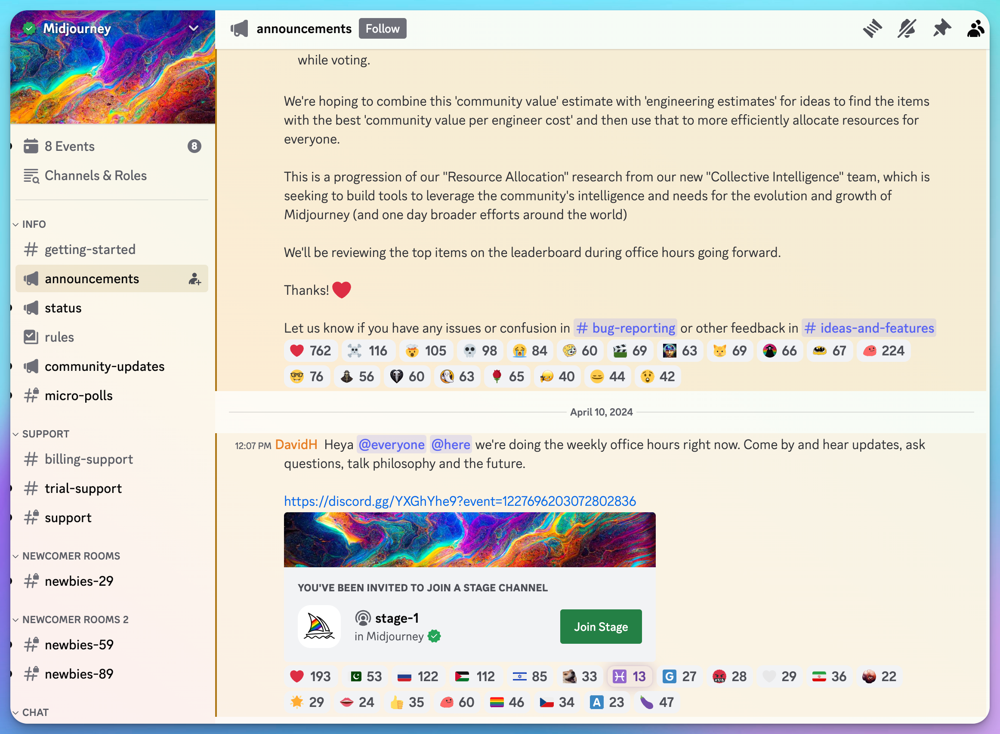

# 🪄 Text to Image / Image Editing Tools


The training data for certain AIGC models, including Stable Diffusion, is currently subject to copyright disputes and legal risks. It is essential to assess these issues in light of the legal standards applicable in your jurisdiction and to approach commercial usage with prudence.


## Native Multimodal Model Image Generation/Editing

ChatGPT

Gemini

Grok

## Open Source:

## Top-tier Applications:



### &#x20;[https://www.midjourney.com/](https://www.midjourney.com/explore)

Midjourney, an AI-powered drawing tool, revolutionizes the creation of art by transforming user-provided text descriptions into stunning artworks. Since its public beta launch in July 2022, access has been primarily through a Discord chatbot (<mark style="color:red;">web version unlocking for those who has generated more than 100 images</mark>). The tool boasts a vast selection of artistic styles, allowing users to refine their creations by tweaking keywords and settings. Known for its ease of use and precision, Midjourney is poised to make a significant impact on the art world.&#x20;

### <mark style="color:orange;">**Midjourney V7**</mark>

Midjourney V7, released in April 2025, is the latest AI image generation model featuring enhanced coherence, photorealistic textures, a new "Draft Mode" for rapid iteration at lower cost, and default personalization based on user preferences.





### <mark style="color:orange;">Leonardo AI</mark>

[https://leonardo.ai/](https://leonardo.ai/)


Leonardo.ai


Leonardo AI is an advanced AI-powered image generation platform that allows users to create high-quality, customizable artwork and visual assets through text prompts, offering features like fine-tuned models, AI canvas editing, and 3D texture generation.



### <mark style="color:orange;">Ideogram</mark>

[https://ideogram.ai/login](https://ideogram.ai/login)



Ideogram is a free-to-use AI-powered text-to-image generation platform that allows users to create images especially logos directly in their web browser without downloading additional software. Ideogram 2.0, the platform's latest update, introduces five different models (General, Realistic, Design, Anime, and 3D), improved text rendering, and a new color palette feature, significantly enhancing the quality and customization options for generated images.

Ideogram Prompting Tips



## Ideogram Canvas, Magic Fill, and Extend

Ideogram released a new Canvas function.

[https://about.ideogram.ai/canvas](https://about.ideogram.ai/canvas)



**Recraft** is a new AI-powered design platform that offers a range of tools like AI image generation, vectorization, and mockup creation to help designers and marketers create stunning visual content.

[https://www.recraft.ai/](https://www.recraft.ai/)



***

## Multifunctional image generation and modification platform



[https://www.canva.com/](https://www.canva.com/)

Canva, a leading name in the image processing sector, has always been at the forefront of integrating AI into its platform. Even before the recent surge in AI advancements, Canva had incorporated numerous AI-driven features, like background removal, among others. Now, leveraging Generative AI (GenAI) technology, Canva has expanded its capabilities into graphic design, video production, and copywriting. This innovation allows even those without professional skills to easily execute a wide range of creative projects.





[https://www.adobe.com/products/firefly.html](https://www.adobe.com/products/firefly.html)

Adobe Firefly, officially launched by Adobe, is a web-based creative tool powered by generative AI. It enables users to craft high-quality images, text styles, and textures with just a few simple text prompts. Beyond these capabilities, Firefly also offers creative fill, AI-powered image enlargement, and canvas stretching among its features. Additionally, Adobe is progressively integrating these advanced technologies into other software within its suite, such as Photoshop.





Adobe MAX recently unveiled its latest Sneaks, showcasing nine innovative projects that promise to revolutionize creative workflows across photography, video, audio, 3D, and design. These early-stage innovations, co-hosted by actress Awkwafina, aim to provide creative professionals with enhanced speed, precision, and power while significantly reducing production time. The projects include:

* &#x20;"Project Perfect Blend" for seamless image compositing
* "Project Clean Machine" for removing unwanted elements from photos and videos
* "Project In Motion" for AI-driven animation creation
* "Project Super Sonic" is used to generate custom sound effects.

Other notable projects focus on 3D vector art rotation, 3D scene layout for 2D image creation, sketch-to-design conversion, and AI-assisted high-quality image generation from screen captures. These advancements demonstrate Adobe's commitment to pushing the boundaries of creative technology and may potentially become key features in future Adobe products.





[https://clipdrop.co/](https://clipdrop.co/)

ClickDrop, formerly associated with the open-source frontrunner Stability AI, has been acquired by Jasper and now offers a variety of AI-powered image editing features.





[https://designer.microsoft.com/](https://designer.microsoft.com/)





Former Stylar.ai

[https://www.dzine.ai/](https://www.dzine.ai/)



***

### Other Image Generate & Editing Apps



[https://](https://ilus.ai/)[ilus.ai/](https://ilus.ai/)

If you're looking to create AI illustrations, ilus is a specialized AI generation service tailored to this niche.&#x20;



[https://www.krea.ai/home](https://www.krea.ai/home)






[https://magnific.ai/](https://magnific.ai/)




[https://magnificai.org/magnific-relight/](https://magnificai.org/magnific-relight/)



Magnific.ai

[https://magnific.ai/](https://magnific.ai/)


