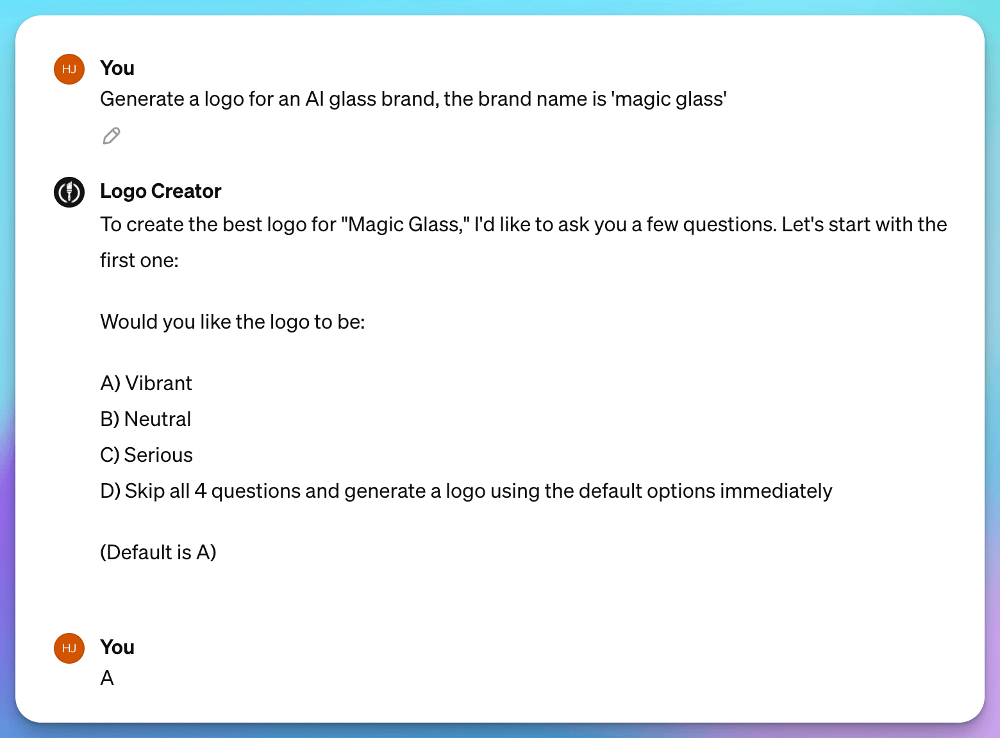
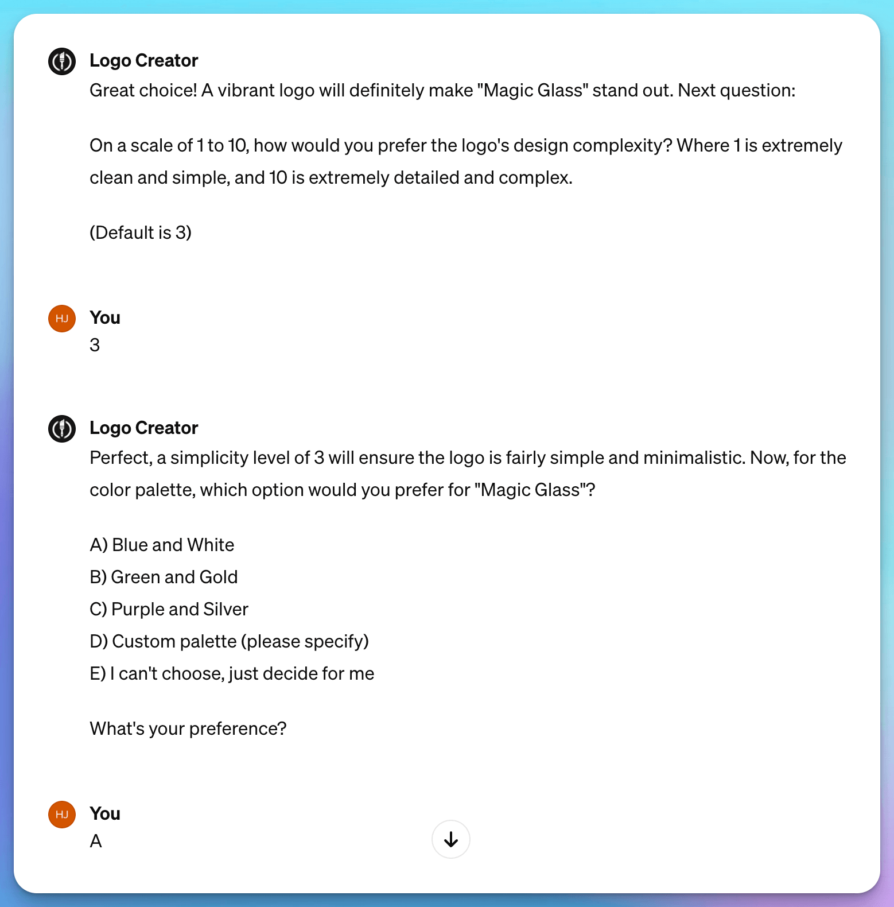
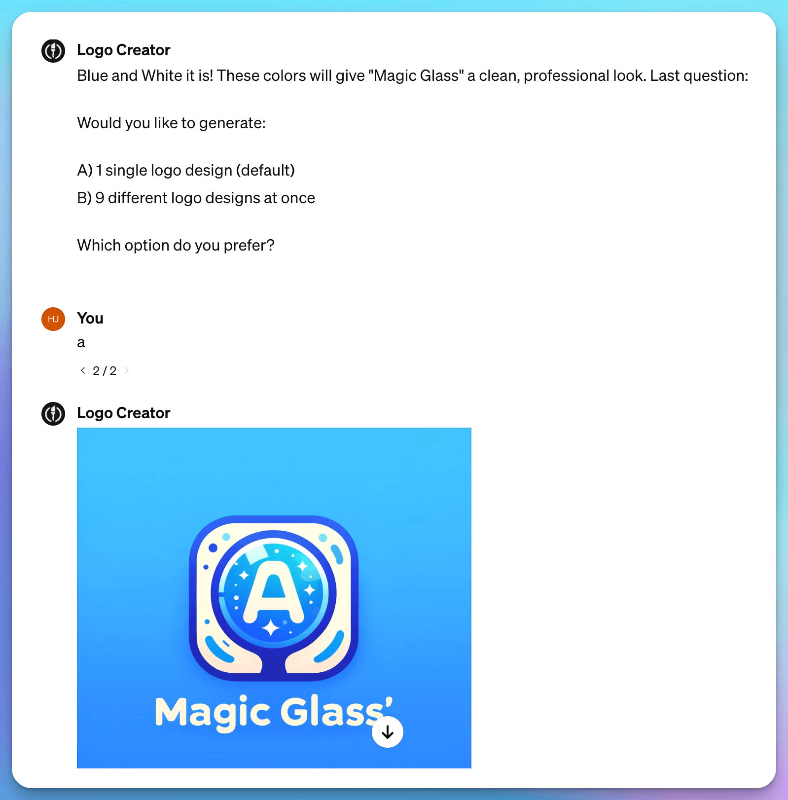

# 🤩 Branding

## Brand builder

Here is a Brand Builder prompt along with a sample of content that users can input; please adjust as required.

**Craft a design brief for a holistic brand identity.** _Source: Anthropic Prompt Library_

**Prompt:**

> Your task is to create a comprehensive design brief for a holistic brand identity based on the given specifications. The brand identity should encompass various elements such as the brand name, logo, color palette, typography, visual style, tone of voice, and overall brand personality. Ensure that all elements work together harmoniously to create a cohesive and memorable brand experience that effectively communicates the brand's values, mission, and unique selling proposition to its target audience.

**User Input Example:**

> Develop a holistic brand identity for a new sustainable fashion brand called "Eco Threads." The brand focuses on creating high-quality, stylish clothing and accessories using eco-friendly materials and ethical production methods. Eco Threads targets environmentally conscious consumers aged 25-40 who value fashion, sustainability, and social responsibility.\
> The brand identity should achieve the following goals:\
> 1\. Reflect the brand's commitment to sustainability, ethical practices, and environmental stewardship.\
> 2\. Appeal to the target audience by conveying a sense of style, quality, and trendiness.\
> 3\. Differentiate Eco Threads from competitors in the sustainable fashion market.\
> 4\. Create a strong emotional connection with consumers and inspire them to make more environmentally friendly choices.

***

## Name & Slogan Creation&#x20;

> Generate digital startup ideas based on the wish of the people. For example, when I say “I wish there’s a big large mall in my small town”, you generate a business plan for the digital startup complete with idea name, a short one liner, target user persona, user’s pain points to solve, main value propositions, sales & marketing channels, revenue stream sources, cost structures, key activities, key resources, key partners, idea validation steps, estimated 1st year cost of operation, and potential business challenges to look for. Write the result in a markdown table. _(Source:Awsome ChatGPT Prompts)_

or

Utilize the "Product Naming Pro" tool from the official Anthropic Prompt Library:

**Create catchy product names from descriptions and keywords.**

**Prompt:**

> Your task is to generate creative, memorable, and marketable product names based on the provided description and keywords. The product names should be concise (2-4 words), evocative, and easily understood by the target audience. Avoid generic or overly literal names. Instead, aim to create a name that stands out, captures the essence of the product, and leaves a lasting impression.

**User Input Example:**

> Description: A noise-canceling, wireless, over-ear headphone with a 20-hour battery life and touch controls. Designed for audiophiles and frequent travelers.\
> \
> Keywords: immersive, comfortable, high-fidelity, long-lasting, convenient

### **GPTs**

or use a GPT from the GPTs store:

#### Name Generator

[https://chat.openai.com/g/g-JcGhdmkI8-name-generator](https://chat.openai.com/g/g-JcGhdmkI8-name-generator)

***

## Logo Design

The easiest way to create a logo is by leveraging the GPT that's seamlessly integrated with the ChatGPT+DallE AI image generation service, allowing for the entire design process to be completed effortlessly in one session. We recommend the <mark style="background-color:orange;">**Logo Creator**</mark> [<mark style="background-color:orange;">**https://chat.openai.com/g/g-gFt1ghYJl-logo-creator**</mark>](https://chat.openai.com/g/g-gFt1ghYJl-logo-creator), a top-rated GPT designed to methodically walk you through adjusting various elements of your logo, including its tone, color, and shape.&#x20;

**Example:**&#x20;

> Prompt: Generate a logo for an AI glass brand, the brand name is 'magic glass'

or you could use tools like stylar.ai to turn sketches into logo images.



At present, OpenAI's DallE does not quite match the brilliance of their GPT and Sora models. Therefore, for those seeking higher quality in logo design, turning to more robust image generation AI tools like **Midjourney** might yield more impressive results.

***

### FForward AI

[https://fforward.ai/](https://fforward.ai/)

Business owners and product managers could use fforward.ai to analyze interviews and synthesize customer opportunities.

