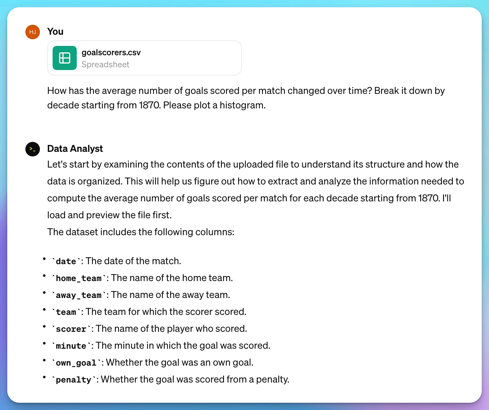
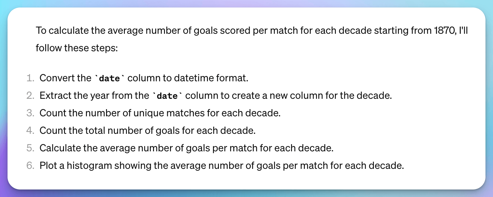
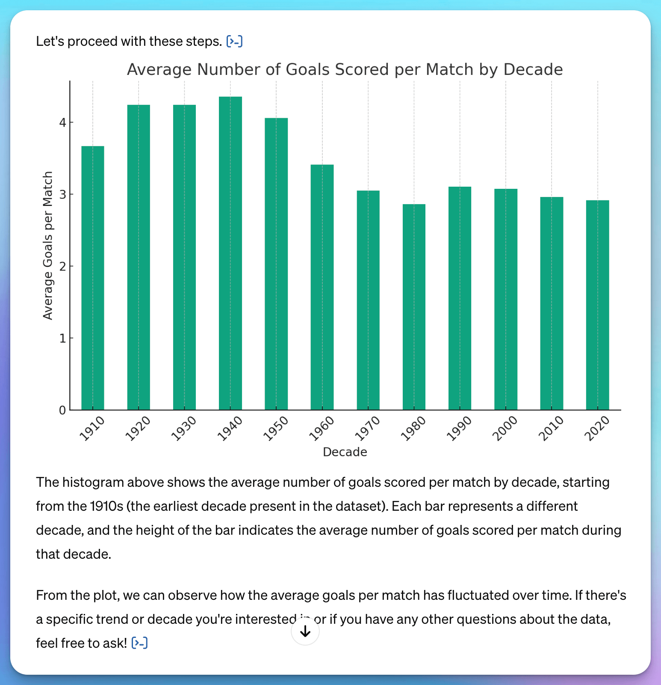

# 👩‍💻 Data Analysis

Data analysis stands as a fundamental pillar of modern commerce and plays a crucial role in the advancement of artificial intelligence. The rapid advancement of large language models (LLM) over the last two years has significantly eased the entry barrier into the data science domain, opening up a broader array of practical applications.

## Small to medium-scale datasets

For analyzing small to medium-scale datasets, simply copy and paste your data into the conversation interfaces of various Large Language Models (such as ChatGPT, Claude, etc.) and engage in a dialogue with the AI to obtain analysis results. Here are some examples of how to structure your **prompts:**&#x20;

> <mark style="color:purple;">I want you to act as a data scientist. Imagine you’re working on a challenging project for a cutting-edge tech company. You’ve been tasked with extracting valuable insights from a large dataset related to user behavior on a new app. Your goal is to provide actionable recommendations to improve user engagement and retention.  (Source:Aowsome ChatGPT Prompts)</mark>


<mark style="color:red;">If dealing with</mark> <mark style="color:red;"></mark><mark style="color:red;">**sensitive data**</mark><mark style="color:red;">, employing online large models, such as ChatGPT, Claude, etc. could pose a risk of data leakage.</mark>&#x20;


When dealing with larger datasets, such as databases exported from SQL or XLSX spreadsheets, the typical copy-and-paste method becomes impractical. Currently, most major LLM applications have introduced support for **uploading** various types of files, allowing us to upload data files into the dialogue box and then enter a prompt for analysis.&#x20;

Additionally, the **GPTs store** already offers a wide array of data analysis GPTs for use, accommodating uploads of various file formats like CSV, PDF, etc., to facilitate data analysis and data visualization tasks.

<mark style="background-color:orange;">**Data Analyst**</mark> from ChatGPT

> Drop in any files and I can help analyze and visualize your data.

Link: [https://chat.openai.com/g/g-HMNcP6w7d-data-analyst](https://chat.openai.com/g/g-HMNcP6w7d-data-analyst)

<mark style="background-color:purple;">**Example:**</mark>

International football results from 1872 to 2024, contain an up-to-date dataset of over 45,000 international football results. Data retrieved from [Kaggle](https://www.kaggle.com/datasets/martj42/international-football-results-from-1872-to-2017?resource=download).

My question and prompt: "**How has the average number of goals scored per match changed over time? Break it down by decade starting from 1870. Please plot a histogram."**

Result:&#x20;

## Improvements to data analysis in ChatGPT

ChatGPT has recently upgraded its data analysis capabilities, enabling it to effectively perform data cleaning, data analysis, and data visualization tasks in a wide range of scenarios.

> Interact with tables and charts and add files directly from Google Drive and Microsoft OneDrive.




Link


## Tools:

### <mark style="color:orange;">Julius AI</mark>&#x20;

[https://julius.ai](https://julius.ai)

Julius AI is a versatile AI-powered data analysis platform that offers features such as creating data visualizations, answering questions about data, performing predictive forecasting, solving math and science problems, and generating polished analyses and summaries.

***

## Large-scale datasets

For analyzing large-scale data, it's still advised to use specialized data analysis software, with many established giants in data analysis incorporating AI functionalities into their products. For instance, the industry leader Tableau has enhanced its software with an AI system, making it more user-friendly and intelligent.

### <mark style="color:orange;">Tableau</mark>

[https://www.tableau.com/products/tableau-ai](https://www.tableau.com/products/tableau-ai)

Tableau AI democratizes data analysis by bringing trusted generative AI to the entire Tableau platform, accelerating time to value and reducing repetitive tasks for data analysts while empowering business users with smart, personalized insights 1 .

### <mark style="color:orange;">Databricks</mark>

[https://www.databricks.com/](https://www.databricks.com/)

Databricks offers a Data Intelligence Platform that unifies data, AI, and governance, allowing organizations to develop generative AI applications, democratize insights, and drive down costs while maintaining data privacy and control 2 .

### <mark style="color:orange;">IBM Cloud Pak for Data</mark>

[https://www.ibm.com/products/cloud-pak-for-data?utm\_content=SRCWW\&p1=Search\&p4=43700074359384704\&p5=p\&p9=58700008187739047\&gclid=Cj0KCQjwjNS3BhChARIsAOxBM6rpL4R0xyVov0M7UobmIREe1IRJt\_RC0-p32ai3SLRjLg-vMbJh6l0aApKdEALw\_wcB\&gclsrc=aw.ds](https://www.ibm.com/products/cloud-pak-for-data?utm\_content=SRCWW\&p1=Search\&p4=43700074359384704\&p5=p\&p9=58700008187739047\&gclid=Cj0KCQjwjNS3BhChARIsAOxBM6rpL4R0xyVov0M7UobmIREe1IRJt\_RC0-p32ai3SLRjLg-vMbJh6l0aApKdEALw\_wcB\&gclsrc=aw.ds)

IBM Cloud Pak for Data is a comprehensive data and AI platform that enables organizations to collect, organize, and analyze data, as well as infuse AI throughout their business to drive innovation and digital transformation.

***

## Learning Resources:

<table data-view="cards"><thead><tr><th></th><th></th><th></th></tr></thead><tbody><tr><td><strong>Open AI</strong></td><td><strong>Enabling a Data-Driven Workforce</strong></td><td>"In this video, we share practical examples of how employees can use ChatGPT Enterprise to efficiently analyze data and uncover insights." <a href="https://openai.com/business/enabling-a-data-driven-workforce-webinar/">https://openai.com/business/enabling-a-data-driven-workforce-webinar/</a></td></tr><tr><td>How to Use ChatGPT’s Advanced Data Analysis Feature</td><td><a href="https://mitsloanedtech.mit.edu/ai/tools/data-analysis/how-to-use-chatgpts-advanced-data-analysis-feature/">https://mitsloanedtech.mit.edu/ai/tools/data-analysis/how-to-use-chatgpts-advanced-data-analysis-feature/</a></td><td></td></tr><tr><td></td><td></td><td></td></tr></tbody></table>

