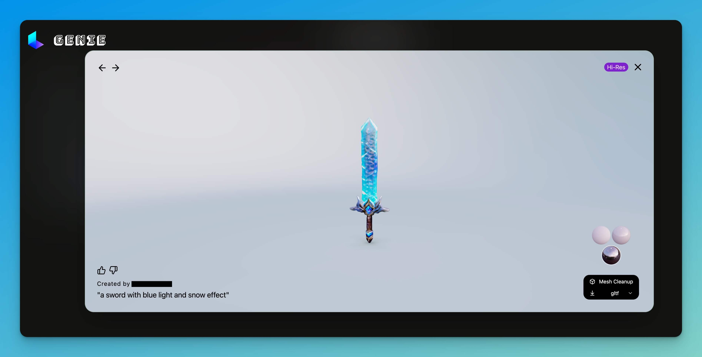

# 🕹️ Game Development

## Navigation:


* AI NPC


***

## Game Development Support Tools

### BuildBox 4 Alpha

BuildBox 4 Alpha has been announced, featuring AI-powered tools for non-programmers to create 3D games easily. Users can generate assets, animations, and entire scenes using text prompts, and edit levels with gesture drawing tools.&#x20;



***

### 3D Model Create

### Kaedim3d

[https://www.kaedim3d.com/](https://www.kaedim3d.com/)

Kaedim3d is a formidable tool for generating 3D models, offering the innovative capability to craft high-fidelity 3D creations either from textual descriptions or by uploading images.



### Luma AI

[https://lumalabs.ai/genie?view=create](https://lumalabs.ai/genie?view=create)

<mark style="color:red;">**Example:**</mark>&#x20;

**My Prompt:** A sword with blue light and snow effect

It created a 3D model of a sword that closely resembles the distinctive style found in World of Warcraft.

<figure><figcaption></figcaption></figure>

***

## Game Engines

### Unity AI

[https://unity.com/ai](https://unity.com/ai)

In 2023, numerous developers introduced ChatGPT plugins for Unity, enabling the automatic generation of diverse code snippets and significantly enhancing the efficiency of game development. Since then, these gaming engines have gone a step further by incorporating their own integrated AI systems. These systems build upon the foundation of Large Language Models (LLMs) and include capabilities for creating graphics and images, thereby further improving the efficiency of developing 3D games and environments.



### AI in Unreal Engine

Unreal Engine, another titan of the industry, has likewise introduced a suite of AI capabilities. These enhancements include the generation of AI-driven content and assets, as well as AI-assisted code debugging, among other advancements.



### BlenderGPT

[https://github.com/gd3kr/BlenderGPT](https://github.com/gd3kr/BlenderGPT)

> This plugin provides an easy to use interface that integrates OpenAI's GPT-4/GPT-3.5 right in the UI, allowing you to use natural language commands to control Blender.

***

### GiiNex

[https://giinex.tencent.com/#/index](https://giinex.tencent.com/#/index)

Tencent's GiiNEX is an innovative game AI engine that leverages generative AI technology to support the creation of diverse game content, including 2D images, 3D scenes, narratives, and dialogue, while also utilizing decision-making AI for game development testing and simulated gameplay.

