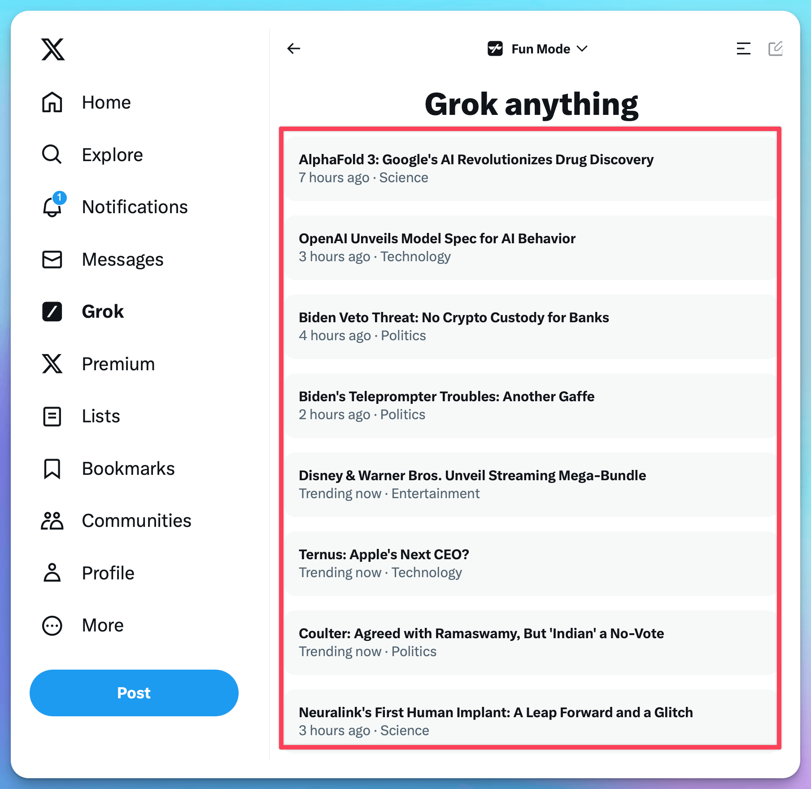

# ℹ️ News/Info Gathering

There are a host of AI-powered tools that journalists and creators can take advantage of to keep up with emerging trends and make the news that they break in real-time and are always effective. Real-time updates are further personalized with the relevance of recommendations made according to personal tastes and past activities. This ensures that impactful topics are always brought to your attention, so you're always on point with regard to what's going to resonate with your audience.

## Tools:



### <mark style="color:orange;">Perplexity -- Discover tab</mark>

In Perplexity, the Discover page presents you with the most stirring news from top stories, thoroughly drawn from various media. Using smart filtering, sorting, and categorizing through advanced AI algorithms, articles are arranged to make sure that users can navigate through the most relevant and thought-provoking articles on a wide range of topics easily and effectively.

[https://www.perplexity.ai/discover](https://www.perplexity.ai/discover)

<figure><figcaption>
perplexity discover page
</figcaption></figure>

#### AI News Podcasting

Recently, in a collaborative effort, <mark style="color:orange;">Perplexity</mark> and <mark style="color:orange;">ElevenLabs</mark> have evolved the Discover section into an AI Podcast.


Perplexity Discover Daily News Channel







A lesser-known yet valuable web-based app. News Minimalist uses AI (ChatGPT-4) to read the top 1000 news every day and rank them by significance on a scale from 0 to 10. Significance is estimated based on seven factors:

> * **scale**: how many people the event affected;
> * **magnitude**: how big was the effect;
> * **potential**: how likely it is that the event will cause bigger events;
> * **novelty**: how unexpected or unique was the event;
> * **immediacy**: how close in time is the event;
> * **actionability**: how likely it is that a reader can act on the news for personal benefit;
> * **positivity**: how positive is the event — used to fix media negativity bias;
> * **credibility**: how credible is the source.



Grok is an AI system created by xAI, drawing inspiration from "The Hitchhiker's Guide to the Galaxy" and "Iron Man's" JARVIS. Grok's primary role is to answer a wide array of questions, always aiming to be maximally helpful. Unlike other AI systems, Grok boasts a unique advantage: accessing up-to-the-minute information via the X platform (formerly Twitter), in tune with the world's latest happenings.&#x20;



<figure><figcaption>
Grok News summary
</figcaption></figure>




## Info Gathering AI Agents:

AI agents can be used to build more advanced and customized AI information-gathering tools. For example, using Make, you can connect to RSS feed applications to collect information, then use LLMs to organize and summarize the data, and finally output it in your desired format. This allows you to efficiently complete various information-gathering tasks.

For detailed information, please refer to the <mark style="color:purple;">**AI Agents**</mark> section.

