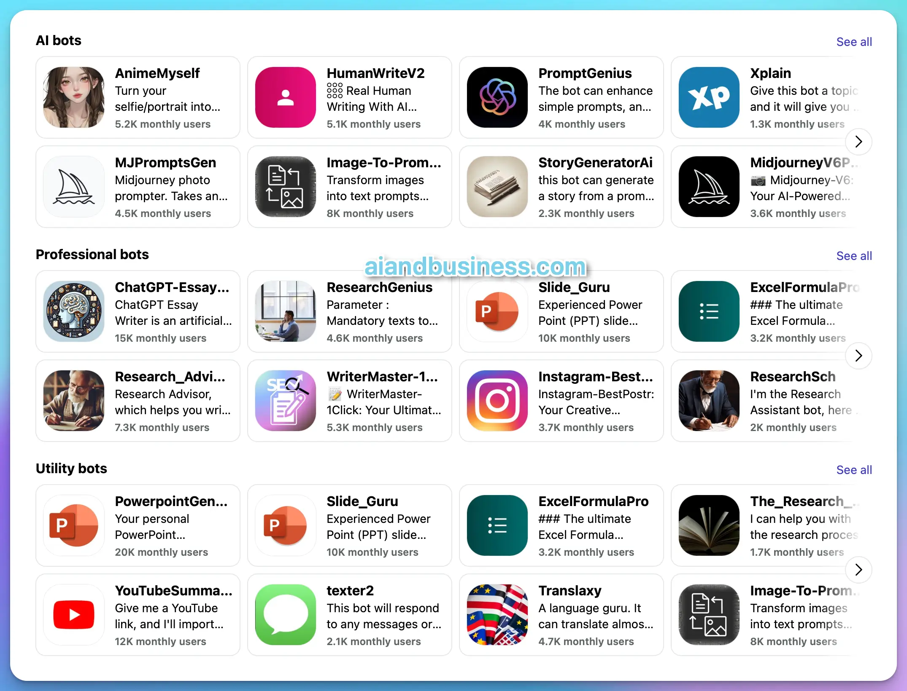

# AI Aggregator/AI Hub

AI aggregator integrates multiple AIs through APIs, offering benefits such as access to various large models like GPT-4 and Claude. It also includes image generation tools like Midjourney and Ideogram and hosts numerous AI bots similar to those in the GPTs Store, including ChatGPT.&#x20;

### <mark style="color:orange;">Poe</mark>

Poe, developed by Quora, is a platform that combines various AI chatbots, enabling users to interact with multiple large language models through a single interface.

<figure><figcaption>
Poe
</figcaption></figure>

<figure><figcaption>
Poe bots
</figcaption></figure>

### <mark style="color:orange;">You.com</mark>

[https://you.com/](https://you.com/)

A more business-focused AI aggregator that integrates a wide range of business application functions, including data analysis, email writing, and marketing tools.

### <mark style="color:orange;">Simplified.com</mark>

[https://simplified.com/](https://simplified.com/)

Simplified.com is an all-in-one AI-powered platform that combines content creation, design, social media management, and collaboration tools to streamline marketing workflows for individuals and teams.

