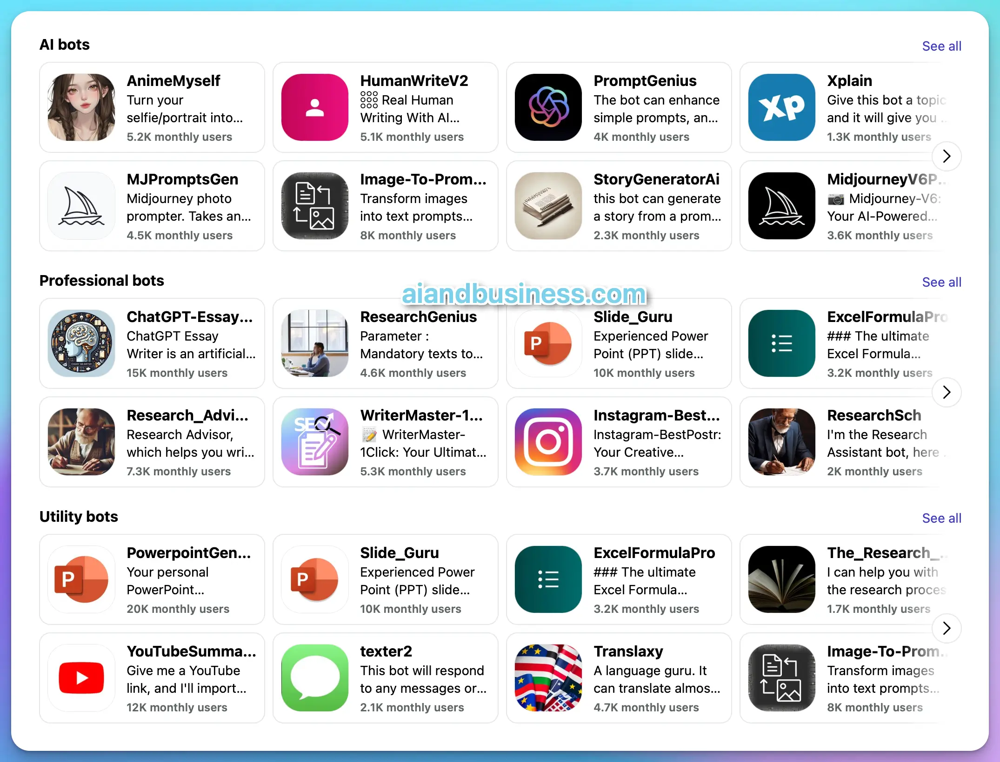

# AI aggregators

AI aggregator integrates multiple AIs through APIs, offering benefits such as access to various large models like GPT-4 and Claude. It also includes image generation tools like Midjourney and Ideogram and hosts numerous AI bots similar to those in the GPTs Store, including ChatGPT.&#x20;

### <mark style="color:orange;">Poe</mark>

Poe, developed by Quora, is a platform that combines various AI chatbots, enabling users to interact with multiple large language models through a single interface.

<figure><figcaption>
Poe
</figcaption></figure>

<figure><figcaption>
Poe bots
</figcaption></figure>

