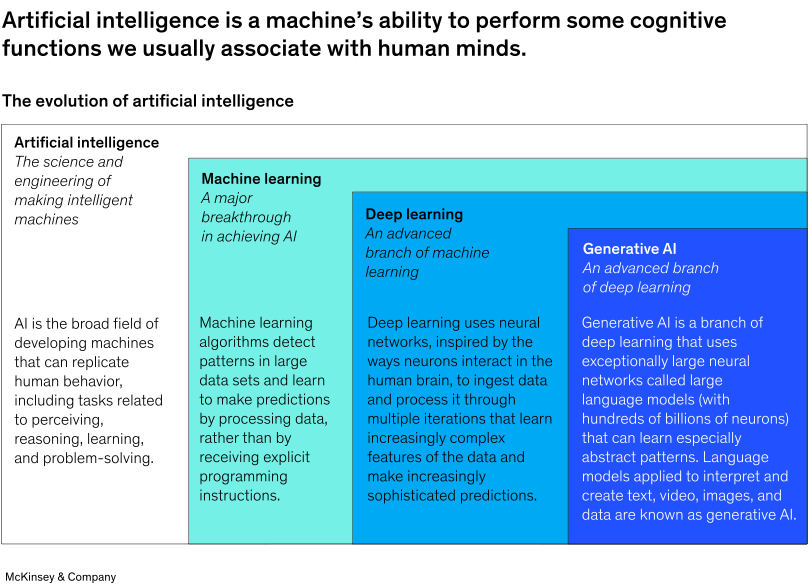

# AI Basics

## <mark style="color:purple;">**What is Artificial Intelligence?**</mark>

Artificial Intelligence refers to the simulation of human intelligence in machines designed to think and act like humans. These machines can perform tasks that typically require human intelligence, such as visual perception, speech recognition, decision-making, and language translation.&#x20;

<figure><figcaption></figcaption></figure>

For more detailed information, you can read this article from McKinsey:



## <mark style="color:purple;">**Key Concepts in AI**</mark>

<table><thead><tr><th width="239">Concept</th><th>Description</th></tr></thead><tbody><tr><td><strong>Machine Learning (ML)</strong></td><td>A subset of AI that involves training algorithms to learn from and make predictions based on data. Can be supervised, unsupervised, or semi-supervised.</td></tr><tr><td><strong>Deep Learning</strong></td><td>A specialized form of machine learning involving neural networks with many layers. Excels in processing large volumes of data, such as images and speech.</td></tr><tr><td><strong>Natural Language Processing (NLP)</strong></td><td>Focuses on the interaction between computers and humans through language. Allows machines to understand, interpret, and generate human language.</td></tr><tr><td><strong>Computer Vision</strong></td><td>Trains computers to interpret and make decisions based on visual data from the world. Powers applications like facial recognition and autonomous driving.</td></tr><tr><td><strong>Robotics</strong></td><td>Involves the design and creation of robots that can perform tasks autonomously or semi-autonomously, integrating various AI technologies.</td></tr><tr><td><strong>Large Language Models (LLM)</strong></td><td>AI models that are trained on vast amounts of text data to understand and generate human-like language. Examples include GPT-3 and BERT.</td></tr><tr><td><strong>AI-generated Content (AIGC)</strong></td><td>The creation of content such as text, images, and videos by AI systems. AIGC is used in areas like marketing, entertainment, and journalism.</td></tr><tr><td><strong>Generative AI (GenAI)</strong></td><td>Refers to AI systems capable of generating new content, such as images, music, and text. It includes technologies like GANs (Generative Adversarial Networks).</td></tr></tbody></table>

